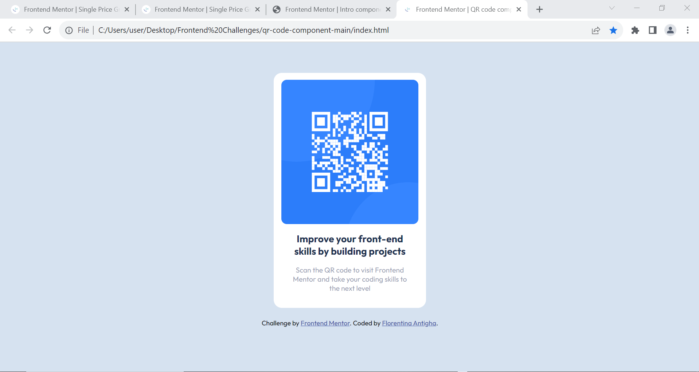

# Frontend Mentor - QR code component solution

This is a solution to the [QR code component challenge on Frontend Mentor](https://www.frontendmentor.io/challenges/qr-code-component-iux_sIO_H). Frontend Mentor challenges help you improve your coding skills by building realistic projects. 

## Table of contents

- [Overview](#overview)
  - [Screenshot](#screenshot)
- [My process](#my-process)
  - [Built with](#built-with)
  - [Continued development](#continued-development)
- [Author](#author)

## Overview

  ### Screenshot

  

## My process

  ### Built with

    - Semantic HTML5 markup
    - CSS custom properties
    - Flexbox
    - Media Queries

  ### Continued development

    I will continue to develop myself on building responsive websites with media queries and master it eventually.

## Author

  - Frontend Mentor - [@Floren-teena](https://www.frontendmentor.io/profile/Floren-teena)